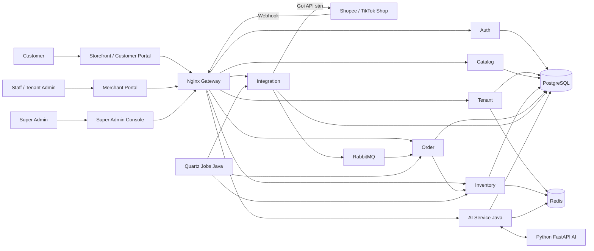

# SmartOmni Platform

SmartOmni là nền tảng SaaS quản trị bán lẻ đa kênh cho các nhà bán hàng trên **Shopee** và **TikTok Shop**. Một tenant quản lý sản phẩm, tồn kho, đơn hàng, khách hàng và dữ liệu kinh doanh từ một nơi. Hệ thống dùng dữ liệu đó để dự báo nhu cầu, gợi ý sản phẩm và hỗ trợ ra quyết định.

Mỗi tenant có một cửa hàng logic, tối đa **một shop Shopee và một shop TikTok Shop**, cùng một Storefront riêng. Storefront giới thiệu sản phẩm và chuyển khách sang sàn để mua; **không có giỏ hàng, checkout hay thu tiền đơn hàng trên SmartOmni**. Thanh toán trong hệ thống chỉ dành cho gói dịch vụ SaaS của tenant.

README này mô tả **hệ thống theo nghiệp vụ mục tiêu**. Phần [Trạng thái triển khai](#trạng-thái-triển-khai) ở cuối phân biệt các chức năng đã có khung với những phần team sẽ tiếp tục phát triển.

## Người dùng và giao diện

| Vai trò | Giao diện | Công việc chính |
|---|---|---|
| Customer | Storefront, Customer Portal | Xem sản phẩm, đi tới sàn để mua, hỏi chatbot, đăng ký tài khoản, claim đơn để tích điểm và xem hạng. |
| Staff | Merchant Portal | Tạo/sửa sản phẩm và SKU, dán URL sản phẩm trên sàn, xử lý luồng đơn, điều chỉnh tồn, in PDF vận đơn, nhận cảnh báo AI và trả lời hội thoại sàn. |
| Tenant Admin | Merchant Portal | Tự đăng ký để tạo tenant, kết nối shop, quản lý Staff, xem báo cáo, quản lý gói SaaS và quyết định phát voucher cho khách. |
| Super Admin | Super Admin Console | Quản trị tenant và gói dịch vụ, xử lý hỗ trợ, khóa/mở tenant vi phạm và giám sát hệ thống. |

Tenant Admin tạo tenant ngay khi đăng ký. Tài khoản Super Admin đầu tiên được thêm trực tiếp vào cơ sở dữ liệu khi khởi tạo hệ thống. Tài liệu cũ có thể dùng tên “Manager”; trong mô hình hiện tại, vai trò vận hành là **Staff**.

## Các chức năng của hệ thống

### Quản lý tenant và gói dịch vụ

- Mỗi tenant có dữ liệu, shop liên kết, nhân sự, cấu hình và giới hạn sử dụng riêng.
- Tenant Admin quản lý hồ sơ cửa hàng, tài khoản Staff, kết nối sàn, gói SaaS và các tính năng được bật theo gói.
- Super Admin quản lý tenant, gói dịch vụ, yêu cầu hỗ trợ, trạng thái khóa/mở và nhật ký bảo mật.
- Thanh toán, nâng/hạ cấp và gia hạn trong SmartOmni áp dụng cho **gói SaaS**, không xử lý tiền mua hàng trên sàn.

### Sản phẩm và Storefront

- Merchant Portal quản lý sản phẩm, ảnh, SKU, giá, chương trình khuyến mãi và URL của sản phẩm tương ứng trên từng sàn.
- Sản phẩm từ shop được đối chiếu với catalog nội bộ; dữ liệu theo kênh giúp theo dõi giá và phát hiện chênh lệch bất thường.
- Storefront của tenant cho khách khám phá sản phẩm, nhận gợi ý hoặc hỏi chatbot rồi mở trang Shopee/TikTok Shop để đặt hàng.

### Đơn hàng và hoàn trả

- Đơn phát sinh trên sàn được đưa về SmartOmni bằng **webhook**; **polling** định kỳ bù các sự kiện bị bỏ lỡ. Đơn được đối chiếu theo tenant, sàn và mã đơn để tránh ghi trùng.
- Staff theo dõi, xử lý nghiệp vụ đơn trong Merchant Portal, in vận đơn PDF và xem các trường hợp hủy, hoàn, trả hoặc tranh chấp.
- Trạng thái hoàn tất và trả hàng lấy từ sàn. Staff và Tenant Admin không tự đánh dấu đơn đã hoàn tất hoặc đã trả hàng.
- Nếu bước trừ tồn kho thất bại, việc xử lý đơn bị từ chối để retry và điều tra khi lỗi kéo dài.

### Tồn kho và đồng bộ ngược lên sàn

- Tồn kho được quản lý theo SKU trong từng tenant; Staff có thể điều chỉnh theo quyền được cấp.
- Khi đơn hợp lệ làm thay đổi tồn, hệ thống ghi sự kiện outbox cùng giao dịch và đồng bộ số lượng mới lên shop liên kết.
- Các lần đồng bộ lỗi được theo dõi để retry và cảnh báo, tránh bỏ sót thay đổi tồn.

### AI và phân tích kinh doanh

- AI dự báo nhu cầu hàng hóa, gợi ý sản phẩm, đưa cảnh báo về tồn kho/giá và hỗ trợ phân tích hiệu quả kinh doanh.
- Dashboard của Tenant Admin tổng hợp các chỉ số theo đơn hàng, doanh thu, sản phẩm, tồn kho và kênh bán; định hướng tiếp theo là AI tư vấn chiến lược kinh doanh.
- Core tính toán AI là **service Python FastAPI riêng**. Java AI Service điều phối lời gọi, lưu kết quả và cung cấp API cho các giao diện hoặc service khác.

### Hội thoại và chăm sóc khách hàng

- Hộp thư chung tập hợp hội thoại **khách ↔ shop** từ Shopee và TikTok Shop để Staff đọc và trả lời trong Merchant Portal, khi shop/app được cấp quyền API tương ứng.
- Hội thoại được tách theo sàn, shop và khách; các thao tác trả lời cần có audit. Webhook nhận cập nhật và polling bù dữ liệu thiếu.
- AI ở hộp thư chỉ phân loại tin thường hoặc khiếu nại để hỗ trợ chuyển xử lý. AI không tự soạn hoặc tự gửi câu trả lời.

### Customer Portal, điểm và voucher

- Khách có tài khoản Customer Portal riêng, chọn shop và nhập mã đơn để claim khi đơn đã hoàn tất trên sàn và qua **15 ngày kể từ thời điểm hoàn tất**. Một đơn chỉ được claim một lần trong tenant.
- Điểm bằng `floor(tiền hàng thực trả sau giảm giá / 1.000 VND)`, không tính phí vận chuyển và thuế. Điểm không hết hạn; hạng theo tổng điểm: Standard dưới 500, Silver từ 500, Platinum từ 1.000, Diamond từ 1.500.
- Tenant Admin chủ động chọn khách hoặc nhóm hạng để phát voucher. Khách không dùng điểm để đổi thưởng. Voucher được tạo và sử dụng trên sàn **nếu API và quyền shop cho phép**; SmartOmni thông báo mã qua email sau khi xác nhận tạo thành công.

## Luồng tổng quan



Các giao diện người dùng và Python AI là thành phần của kiến trúc tổng thể; chúng không nằm trong monorepo Java hiện tại.

## Các service và trách nhiệm

| Thành phần | Trách nhiệm trong hệ thống |
|---|---|
| **Nginx Gateway** | Điểm vào HTTP công khai, định tuyến API và webhook tới service tương ứng; chặn endpoint job nội bộ. |
| **Auth Service** | Đăng nhập, phiên/JWT, quên và đặt lại mật khẩu, xác thực người dùng. |
| **Tenant Service** | Onboarding tenant, cấu hình cửa hàng, gói SaaS, feature flag, giới hạn sử dụng, support ticket và quản trị tenant. |
| **Catalog Service** | Sản phẩm, SKU, ảnh, mapping URL/item trên sàn, giá và khuyến mãi theo kênh. |
| **Inventory Service** | Tồn kho theo SKU, điều chỉnh/trừ tồn và outbox để đồng bộ tồn ngược lên sàn. |
| **Order Service** | Đơn hàng đa kênh, idempotency, trạng thái, hoàn/trả và xử lý đơn nhận từ webhook hoặc polling. |
| **Integration Service** | Kết nối shop Shopee/TikTok, xác thực webhook, adapter API sàn và đồng bộ sản phẩm/giá/tồn. |
| **AI Service (Java)** | API và dữ liệu AI của SmartOmni, điều phối dự báo/gợi ý với Python AI và lưu kết quả. |
| **Jobs Service (Java + Quartz)** | Lập lịch polling đơn, đồng bộ giá và phát sự kiện outbox qua endpoint nội bộ có token. |
| **Python AI (FastAPI, repo riêng)** | Tính toán mô hình, dự báo nhu cầu, gợi ý sản phẩm và các tác vụ AI chuyên sâu. |
| **PostgreSQL / Redis / RabbitMQ** | Lưu dữ liệu nghiệp vụ; cache; hàng đợi sự kiện giữa các service. |

`smartomni-common` cung cấp các thành phần Java dùng chung như tenant context, JWT, entity nền, exception và response. `smartomni-db-migrations` quản lý schema bằng Flyway; `smartomni-migration-tests` kiểm tra migration, RLS và khởi động service. Chat, Customer Portal, voucher và thanh toán SaaS là các miền nghiệp vụ của hệ thống nhưng chưa có service/API hoàn chỉnh trong repo này.

## Bảo mật và dữ liệu tenant

- Các entity nghiệp vụ thuộc tenant mang `tenant_id`; Java service xác thực JWT và lập `TenantContext` cho request. Header tenant/role do client gửi không tự cấp quyền.
- PostgreSQL Row-Level Security (RLS) giới hạn truy cập theo tenant; migration Flyway quản lý schema, Hibernate dùng `validate`.
- Webhook phải xác thực chữ ký từ sàn trước khi xử lý. Nginx không mở `/internal/jobs/*`; Quartz worker gọi các endpoint này bằng token nội bộ.
- Không commit `.env`, khóa, thông tin đăng nhập, file log, database dump hoặc output build.

## Chạy local

Yêu cầu: **JDK 17+**, **Maven 3.9+**, **Docker** và **Docker Compose**.

1. Copy `.env.example` thành `.env` và thay toàn bộ giá trị mẫu bằng secret dùng trên máy của bạn.
2. Từ thư mục gốc, chạy:

   ```bash
   docker compose up -d --build
   docker compose ps
   ```

3. API đi qua Nginx tại `http://localhost:8080`. RabbitMQ Management tại `http://localhost:15672`. Xem log bằng `docker compose logs -f`; dừng bằng `docker compose down`.

Để phát triển từng service trong IDE, chạy `docker compose up -d postgres redis rabbitmq`, cài các module phụ thuộc bằng `mvn clean install` rồi chạy `mvn spring-boot:run` trong service cần debug. Spring Boot chạy từ IDE không tự đọc file `.env` của Compose; cần truyền các biến môi trường tương ứng.

Python FastAPI chạy riêng. Java AI Service đọc `PYTHON_AI_BASE_URL`; khi Python chạy trên máy host và Java chạy trong Docker, giá trị mặc định là `http://host.docker.internal:8000`. Khi cả hai cùng chạy trong một Docker network, đặt URL theo tên service Python.

Kiểm tra Java và migration bằng `mvn -B clean verify`. Hướng dẫn chi tiết: [thiết lập database local](docs/local-database-setup.md) và [database migrations](docs/database-migrations.md).

## Trạng thái triển khai

Repo hiện có khung 7 domain service Spring Boot, Nginx Gateway, Quartz worker, Flyway/RLS, Docker Compose và kiểm thử migration/khởi động. Một số controller, entity và luồng nền đã có mã khởi đầu; **đây chưa phải toàn bộ nghiệp vụ hoàn chỉnh**.

Các adapter Shopee/TikTok, Python AI, giao diện Storefront/Merchant/Customer/Super Admin, inbox CSKH, loyalty/voucher, thanh toán SaaS và một số bước xử lý đơn/tồn vẫn cần triển khai hoặc đối chiếu API thật. Khả năng tạo voucher và đồng bộ hội thoại phụ thuộc quyền API sàn cấp cho từng shop. Quartz hiện dùng memory job store cho local; trước khi chạy nhiều worker trên server cần chuyển sang JDBC job store. Thư mục `smartomni-gateway/` là mã Spring Gateway cũ, không nằm trong Maven build hoặc Docker Compose đang sử dụng.

## Tài liệu

- [Kiến trúc và luồng dữ liệu](docs/architecture.md)
- [Quyết định sản phẩm](docs/project-context.md)
- [Luồng CSKH và loyalty](docs/SmartOmni_Additional_Flows_Detailed.md)
- [Sơ đồ dữ liệu](docs/erd.dbml)
- [Hướng dẫn đóng góp](CONTRIBUTING.md)
