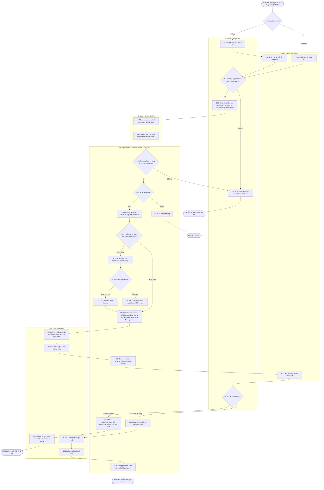
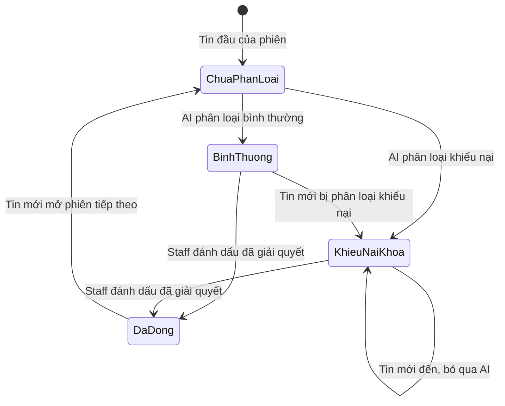
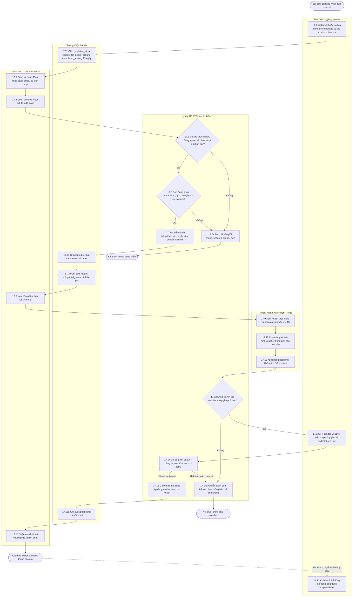

# BÁO CÁO ĐẶC TẢ SƠ ĐỒ HOẠT ĐỘNG — HAI LUỒNG BỔ SUNG

**HỆ THỐNG QUẢN TRỊ BÁN LẺ ĐA KÊNH SMARTOMNI**

*Bản planning, cập nhật theo quyết định của chủ dự án ngày 05/10/2026. Bổ sung Luồng 16 và 17 cho `SmartOmni_All_Flows_Detailed.md`; không phải tài liệu mô tả chức năng đã chạy đầu cuối.*

## Quy ước và ranh giới

- Mỗi tenant có một cửa hàng logic, kết nối tối đa một tài khoản shop Shopee và một tài khoản shop TikTok Shop. Storefront chỉ giới thiệu sản phẩm, tư vấn AI và dẫn khách sang sàn để mua; Customer Portal riêng phục vụ tài khoản khách và tích điểm.
- Bốn nhóm người dùng là Customer, Staff, Tenant Admin và Super Admin. Storefront/Merchant Portal/Customer Portal/Super Admin Console là bề mặt giao diện, không phải người dùng thứ năm.
- Dữ liệu đơn, sản phẩm và tin nhắn đến từ API của từng sàn. Webhook nhận thay đổi gần thời gian thực; polling dùng để phát hiện sự kiện bỏ lỡ. Các thao tác trên sàn vẫn phải tuân theo khả năng và quyền API thực tế của mỗi sàn.
- Sơ đồ thể hiện **nghiệp vụ mục tiêu**. Mọi phần ghi “cần xác minh API” hoặc “đề xuất vận hành” là điều kiện thiết kế, chưa phải cam kết của Shopee/TikTok hay mã nguồn hiện tại.

# LUỒNG 16: ĐỒNG BỘ TIN NHẮN SHOPEE/TIKTOK & PHÂN LOẠI KHIẾU NẠI

**Mô tả Luồng:**

Khách nhắn với shop trên Shopee hoặc TikTok Shop. SmartOmni nhận tin từ webhook, polling bù các tin bị bỏ lỡ kể từ lúc kết nối (không nhập lịch sử cũ), lưu riêng hội thoại theo tenant + sàn + shop + khách trên sàn, rồi hiển thị trong một hộp thư chung của Staff. Staff trả lời từ Merchant Portal; SmartOmni gửi qua API của sàn. AI trong hộp thư **chỉ phân loại tin “khiếu nại” hoặc “bình thường”**. Khi phát hiện khiếu nại, phiên được khóa ở trạng thái khiếu nại, các tin tiếp theo bỏ qua AI và được chuyển thẳng cho Staff cho đến khi Staff đánh dấu đã giải quyết. Không có AI soạn, tự gửi hoặc tự trả lời tin nhắn sàn. AI chatbot tư vấn trên Storefront là luồng khác.

**Phân vùng Swimlanes (Activity Partitions):**

1. Customer và Shopee/TikTok Shop.
2. Gateway/Integration Service và tác vụ polling.
3. Message Queue/Message Sync Worker (dự kiến).
4. Message Service, Session Router, AI Intent Classifier và kho dữ liệu theo tenant (dự kiến).
5. Staff trên Merchant Portal; Monitoring và Tenant Admin cho cảnh báo kết nối.

**Mã nguồn sơ đồ Mermaid (Activity Diagram):**

**State machine phiên CSKH theo ảnh tham chiếu:**

**Cách vận hành và quy tắc:**

1. Khi kết nối sàn, chỉ bắt đầu nhận tin từ thời điểm kết nối; polling đọc tiếp từ checkpoint theo từng shop. Polling không dùng để nhập toàn bộ hội thoại lịch sử.
2. Hộp thư là giao diện chung, nhưng Shopee và TikTok vẫn có hội thoại, ID khách và lịch sử đơn riêng. Không gộp danh tính khách giữa hai sàn. Khóa chống trùng dự kiến gồm `tenant_id + connection_id + external_message_id`.
3. Hỗ trợ văn bản, ảnh, video, tệp, sticker, thẻ sản phẩm và thẻ đơn **theo loại nội dung được API từng sàn cho phép đọc/gửi**. Loại chưa hỗ trợ phải được hiển thị như nội dung không thể xem hoặc chặn gửi, không giả lập thành văn bản.
4. Staff chịu trách nhiệm toàn bộ phản hồi, kể cả tin bình thường. Nhiều Staff có thể mở hội thoại; lịch sử phải ghi người gửi và thời điểm. Khi cùng gửi, hệ thống xếp thứ tự và chống gửi trùng, không để AI tự trả lời.
5. AI chỉ chạy khi phiên chưa khóa. Nếu kết quả là khiếu nại, khóa trạng thái ngay trước khi giao Staff. Tin tiếp theo của phiên bị khóa không được phân loại lại; Staff bấm “Đã giải quyết” để đóng phiên. Tin đến sau đó mở phiên mới. Kết quả AI không chắc chắn được chuyển cho Staff dưới nhãn “cần kiểm tra” (đề xuất), không tự đóng phiên.
6. Liên kết đơn cần **ID khách mua hàng tương ứng trong cùng shop/sàn**, không dùng tên hiển thị. Có thể hiển thị danh sách đơn liên quan để Staff chọn đơn đang được hỏi; không gắn mọi tin vào một đơn mặc định. Nếu thiếu ID hoặc không xác minh được cặp ID, chỉ hiển thị hội thoại và cho tìm đơn thủ công trong phạm vi shop.
7. Ngưỡng vận hành **đề xuất**: tin chưa xuất hiện sau 5 phút thì đánh dấu chậm đồng bộ và cảnh báo vận hành; lệnh gửi chưa có kết quả sau 15 giây hiển thị lỗi/chưa rõ trên giao diện và ghi monitoring. Với timeout, phải đối soát trước khi gửi lại để tránh hai phản hồi.
8. Khi token hết hạn, sàn mất kết nối hoặc quyền API bị thu hồi: tạm ngưng đồng bộ/gửi, gửi email cho Tenant Admin, đồng thời hiển thị cảnh báo trong Merchant Portal cho Tenant Admin và Staff lúc đăng nhập. Ghi audit cho nhận tin, phân loại, gửi, retry, khóa/đóng phiên và lỗi kết nối.
9. Theo quyết định sản phẩm, lưu hội thoại không đặt ngày xóa tự động. Quyền truy cập vẫn phải giới hạn theo tenant và vai trò; kế hoạch lưu trữ và chi phí cần đánh giá theo tải giả định khoảng **500 tin/ngày/tenant** (người dùng ghi “5p0”, tạm hiểu là 500).

**Đối chiếu API tại thời điểm lập kế hoạch:**

- [TikTok Get Conversation](https://partner.tiktokshop.com/docv2/page/get-conversation-202601) trả `participants[].im_user_id` **và** `participants[].user_id`; [Get Order List](https://partner.tiktokshop.com/docv2/page/get-order-list-202309) cho lọc `buyer_user_id`. **Suy luận cần kiểm thử với dữ liệu thật:** `participants[].user_id` có thể dùng để so với `buyer_user_id`; không được mặc định `im_user_id` là cùng loại ID. Cần cùng `shop_cipher`, scope Customer Service và Order Information.
- [TikTok Send Message](https://partner.tiktokshop.com/docv2/page/send-message) có API gửi vào `conversation_id`, nhưng loại nội dung và quyền truy cập phụ thuộc phiên bản, thị trường và scope được cấp.
- Với Shopee, trang Open Platform trực tiếp không truy cập được trong lần kiểm tra này; chưa xác nhận chính thức trường định danh khách chat tương ứng với trường định danh người mua trong Order API. Việc nối đơn tự động trên Shopee phải qua kiểm thử API thật trước khi đặc tả thành khả năng chắc chắn.

# LUỒNG 17: CLAIM ĐƠN, TÍCH ĐIỂM, NÂNG HẠNG VÀ ADMIN PHÁT VOUCHER

**Mô tả Luồng:**

Customer đăng ký Customer Portal bằng email và số điện thoại, chọn shop, nhập mã đơn sàn để claim thủ công. Đơn phải thuộc tenant/shop đó, đã thực sự hoàn tất và qua **15 ngày kể từ mốc hoàn tất**. Người claim hợp lệ đầu tiên nhận điểm; theo quyết định hiện tại không xác minh người claim là người mua trên sàn. Điểm bằng `floor(tiền hàng khách thực trả / 1.000 VND)`, không tính vận chuyển và thuế; tỷ lệ cố định cho mọi shop. Điểm tích lũy không hết hạn, không bị tiêu khi nhận ưu đãi và dùng để xác định hạng. Tenant Admin tự cân nhắc chọn khách/hạng, tạo voucher qua API sàn khi API được phép, rồi SmartOmni gửi email thông báo mã cho khách. Khách sử dụng mã trên ứng dụng Shopee/TikTok, không đổi thưởng trong SmartOmni.

**Phân vùng Swimlanes (Activity Partitions):**

1. Shopee/TikTok Shop và luồng đồng bộ đơn.
2. Customer trên Customer Portal.
3. Loyalty API/worker theo tenant (dự kiến).
4. PostgreSQL: orders, claims, ledger, point accounts và audit (schema cần điều chỉnh).
5. Tenant Admin trên Merchant Portal, voucher adapter và email service (dự kiến).

**Mã nguồn sơ đồ Mermaid (Activity Diagram):**

**Cách vận hành và quy tắc:**

1. Order Service nhận `completed` từ sàn qua webhook hoặc polling. Trạng thái `completed`/`returned` do sàn quyết định, Staff/Tenant Admin không sửa tay. Chỉ khi đã có mốc hoàn tất mới đặt `eligible_for_points_at = completed_at + 15 ngày`. Đây là quy tắc nghiệp vụ được chốt, cần xác định múi giờ và nguồn timestamp của từng sàn khi triển khai.
2. Sau ngày đủ điều kiện, Customer có thể claim bất kỳ lúc nào; điểm không hết hạn. Một đơn chỉ được claim một lần trong tenant. Cho phép claim đơn từ cả hai shop của tenant và cộng chung vào một tài khoản Customer Portal; không đồng bộ danh tính khách giữa Shopee và TikTok.
3. API tra mã đơn trong đúng tenant và shop, giới hạn số lần thử và không tiết lộ thông tin đơn trước khi claim. **Quyết định đã chốt:** người claim hợp lệ đầu tiên được điểm dù chưa xác minh chủ đơn. Đây là quy tắc sản phẩm chủ động, cần được thể hiện rõ trên UI và audit để xử lý tranh chấp.
4. Điểm được tính từ **tiền hàng thực trả**, sau giảm giá và không gồm vận chuyển/thuế. `floor(amount / 1000)`; ví dụ 500.999 VND cho 500 điểm. Tỷ lệ không cho tenant thay đổi. Nếu API sàn không trả đủ thành phần tiền để tính chính xác, đơn phải chờ đối soát, không dùng `total_amount` chưa rõ cấu phần.
5. Hạng dùng tổng điểm tích lũy: dưới 500 `standard`, từ 500 `silver`, từ 1.000 `platinum`, từ 1.500 `diamond`. Không có đổi điểm lấy voucher, không trừ điểm khi Admin phát mã, không hạ hạng trong quy tắc thông thường. Theo giả định nghiệp vụ, sau 15 ngày không còn hoàn/trả cần đảo điểm; trường hợp sàn vẫn ghi hoàn/trả sau mốc này là ngoại lệ cần quyết định riêng nếu xuất hiện.
6. Tenant Admin chọn khách hoặc nhóm hạng đủ điều kiện, tự quyết định có phát voucher hay không. Khách không có nút yêu cầu/đổi quà. Mỗi đợt phát hành cần ghi ai tạo, shop, người nhận, tham số voucher, ID ngoài, kết quả, thời điểm và kết quả gửi email. Email chỉ được gửi khi đã xác nhận voucher tồn tại trên đúng shop.
7. Voucher được tạo và sử dụng trên sàn, SmartOmni chỉ điều phối tạo qua API và thông báo email. Các giới hạn về thời gian, ngân sách, sản phẩm, đối tượng và theo dõi đã sử dụng phải lấy theo quyền/API thực tế từng sàn. Nếu sàn không có endpoint tạo voucher được cấp quyền, nhánh phát hành qua SmartOmni **không khả dụng cho sàn đó**; không âm thầm ghi một mã nội bộ giả.
8. Khi gọi API tạo voucher bị timeout, trạng thái là *chưa rõ*. Worker phải kiểm tra ID yêu cầu/tra cứu trên sàn trước khi tạo lần nữa; “cấp hai mã” nghĩa là một lần nhấn phát thưởng nhưng retry tạo ra hai voucher trên sàn. Tránh gửi email trước khi đối soát xong. Nếu API cho phép, theo dõi trạng thái mã sử dụng/hết hạn để audit; nếu không, ghi “không có dữ liệu từ sàn”.
9. Audit áp dụng cho claim, thay đổi điểm/hạng, chọn khách, phát mã, gửi email và lỗi. Thanh toán tại SmartOmni chỉ là thanh toán gói SaaS của Tenant, không phải thanh toán đơn hàng trên Storefront.

**Đối chiếu API và mã nguồn:**

- [TikTok Search Coupon List](https://partner.tiktokshop.com/docv2/page/search-coupon-list-202406) là API **đọc** coupon và tài liệu ghi coupon được tạo tại Seller Center/Seller App. Vì vậy chưa có bằng chứng từ nguồn chính thức đã xem rằng SmartOmni có thể tạo coupon TikTok qua API. Yêu cầu “Admin tạo qua API” chỉ có thể triển khai khi tìm được endpoint và scope chính thức phù hợp thị trường/tài khoản; đây là điểm phụ thuộc cần xác minh, không phải nhánh đã xác nhận.
- Với Shopee, chưa xác minh được tài liệu chính thức truy cập công khai về endpoint tạo voucher và quyền của ứng dụng. Cần thử với app/shop được cấp quyền trước khi chốt adapter.
- Migration `V7__create_order_loyalty.sql` và `V8__loyalty_milestone_rewards.sql` hiện đã có bảng claim, ledger, hạng và **cơ chế reward campaign/request**; cơ chế request đó không còn đúng với quyết định mới là Admin chủ động phát voucher. V8 hiện lấy `orders.total_amount` khi claim, chưa chắc bằng “tiền hàng thực trả không gồm ship/thuế”. Khi bắt đầu coding phải thiết kế migration phiên bản mới, **không sửa migration V7/V8 đã áp dụng**. Chưa có Customer Portal API, mốc hoàn tất +15 ngày, worker voucher hay email trong các service hiện tại.
